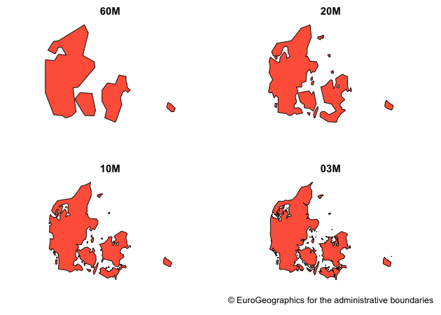
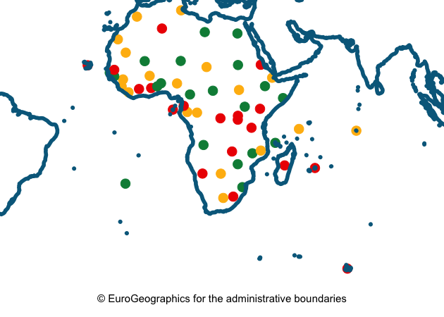
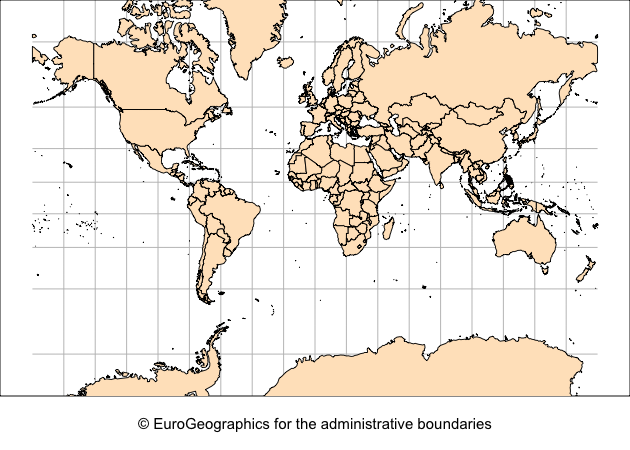

<!-- README.md is generated from README.Rmd. Please edit that file -->

# giscoR 

<!-- badges: start -->

[](https://ci.appveyor.com/project/dieghernan/giscoR)
[](https://travis-ci.com/dieghernan/giscoR)

[](https://codecov.io/gh/dieghernan/giscoR)
[](https://github.com/dieghernan/giscoR/actions)
<!-- badges: end -->

giscoR is a API package that helps to retrieve data from [Eurostat -
GISCO (the Geographic Information System of the
COmmission)](https://ec.europa.eu/eurostat/web/gisco). It also provides
some lightweight data sets ready to use without downloading. Currently
only the [Administrative Units / Statistical
Units](https://ec.europa.eu/eurostat/web/gisco/geodata/reference-data/administrative-units-statistical-units)
data sets are supported.

GISCO [(FAQ)](https://ec.europa.eu/eurostat/web/gisco/faq) is a
geospatial open data repository including several data sets as
countries, coastal lines, labels or [NUTS
levels](https://ec.europa.eu/eurostat/web/regions-and-cities/overview).
The data sets are usually provided at several resolution levels
(60M/20M/10M/03M/01M) and in 3 different projections (4326/3035/3857).

Note that the package does not provide metadata on the downloaded files,
the information is available on the [API
webpage](https://gisco-services.ec.europa.eu/distribution/v2/).

## Recommended packages

It is recommended also to install the `eurostat` package
(<http://ropengov.github.io/eurostat/>):

> Leo Lahti, Przemyslaw Biecek, Markus Kainu and Janne Huovari.
> 
> Retrieval and analysis of Eurostat open data with the eurostat
> package. R Journal 9(1):385-392, 2017. R package version 3.6.5.
> 
> URL: <http://ropengov.github.io/eurostat>

Some other packages recommended for visualization are:

  - [`tmap`](https://mtennekes.github.io/tmap)  
  - [`cartography`](http://riatelab.github.io/cartography/docs/)
  - [`ggplot2`](https://github.com/tidyverse/ggplot2) +
    [`ggspatial`](https://github.com/paleolimbot/ggspatial)
  - [`leaflet`](https://rstudio.github.io/leaflet/)

Some of the datasets identify the countries by using the [Eurostat
Country
Code](https://ec.europa.eu/eurostat/statistics-explained/index.php/Glossary:Country_codes).
The equivalence on ISO-3 (and another codification systems) could be
done using the `countrycode`
[package](https://vincentarelbundock.github.io/countrycode):

``` r
library(countrycode)

# Names to ISO3 - Spanish
names.es <- c("Portugal", "Egipto", "Peru", "Polonia")
iso3_1 <- countryname(names.es, destination = "iso3c")

cbind(names.es, iso3_1)
#>      names.es   iso3_1
#> [1,] "Portugal" "PRT" 
#> [2,] "Egipto"   "EGY" 
#> [3,] "Peru"     "PER" 
#> [4,] "Polonia"  "POL"

# Names to ISO3 - mixed languages
names.mix <-
  c("Greece", "Espagne", "Reino Unido", "Frankreich", "Brasilien")
iso3_2 <- countryname(names.mix, destination = "iso3c")

cbind(names.mix, iso3_2)
#>      names.mix     iso3_2
#> [1,] "Greece"      "GRC" 
#> [2,] "Espagne"     "ESP" 
#> [3,] "Reino Unido" "GBR" 
#> [4,] "Frankreich"  "FRA" 
#> [5,] "Brasilien"   "BRA"

# Translate from ISO3 to eurostat codes
iso3_3 <- c(iso3_1, iso3_2)
eurostat <- countrycode(iso3_3, "iso3c", "eurostat")

cbind(iso3_3, eurostat)
#>       iso3_3 eurostat
#>  [1,] "PRT"  "PT"    
#>  [2,] "EGY"  "EG"    
#>  [3,] "PER"  "PE"    
#>  [4,] "POL"  "PL"    
#>  [5,] "GRC"  "EL"    
#>  [6,] "ESP"  "ES"    
#>  [7,] "GBR"  "UK"    
#>  [8,] "FRA"  "FR"    
#>  [9,] "BRA"  "BR"
```

## Installation

You can install the developing version of `giscoR` with:

``` r
library(remotes)
install_github("dieghernan/giscoR")
```

## A note on caching

Some data sets (as Local Administrative Units - LAU, or high-resolution
files) may have a size larger than 50MB. You can use `giscoR` to create
your own local repository at a given location passing the following
option:

``` r
options(gisco_cache_dir = "./path/to/location")
```

When this option is set, `giscoR` would look for the cached file and it
will load it, speeding up the process.

You can also download manually the files (`.geojson` format) and stored
on that library.

## Demo

This script quickly shows how the data retrieved with giscoR can be
represented with a sample of complementary packages:

``` r
library(giscoR)

countries <- gisco_get_countries(epsg = 3035)

nuts2 <- gisco_get_nuts(epsg = 3035, nuts_level = 2)

# With ggplot2
library(ggplot2)
ggplot(countries) + geom_sf(colour = "grey50",
                            fill = "cornsilk",
                            size = 0.1)  +
  geom_sf(
    data = nuts2,
    colour = "darkblue",
    fill = NA,
    size = 0.05
  )   + coord_sf(
    xlim = c(2200000, 7150000),
    ylim = c(1380000, 5500000),
    expand = TRUE
  ) + xlab("Longitude") + ylab("Latitude") + ggtitle("NUTS2 Regions (2016)") +
  theme(
    panel.grid.major = element_line(
      color = gray(.5),
      linetype =  "dashed",
      size = 0.5
    ),
    panel.background = element_rect(fill =  "aliceblue")
  ) + labs(caption = gisco_attributions(copyright = FALSE))
```

<!-- -->

``` r

# With tmap

library(tmap)

cities <-
  gisco_get_urban_audit(year = "2020",
                        level = "GREATER_CITIES",
                        country = "BEL")
#> [1] "https://gisco-services.ec.europa.eu/distribution/v2/urau/geojson/URAU_RG_100K_2020_4326_GREATER_CITIES.geojson"
#> [1] "Loading from cache dir: /var/folders/24/8k48jl6d249_n_qfxwsl6xvm0000gn/T//Rtmp1h2mBo/gisco"
#> 312 Kb
countries <- gisco_get_countries(country = "BEL", resolution = "10")

tm_shape(countries) + tm_fill("cornsilk2") + tm_borders("grey50") + tm_shape(cities) + tm_fill("purple4") +
  tm_credits(gisco_attributions(copyright = FALSE),
             position = c("LEFT", "BOTTOM")) + tm_layout(
               main.title = "Urban Audit 2020: Greater Cities of Belgium",
               frame = TRUE,
               attr.outside = TRUE,
               main.title.size = 1
             )
```

<!-- -->

``` r

# With cartography
library(cartography)
globe <- gisco_get_countries(epsg = "3035")
globe <- merge(globe, gisco_countrycode, all.x = TRUE)
opar <- par(no.readonly = TRUE)
par(mar = c(2, 2, 2, 2))
typoLayer(globe, var = "un.region.name", legend.pos = "n")
layoutLayer(
  "Regions of the World (UN)",
  sources = gisco_attributions(copyright = FALSE),
  scale = FALSE,
  horiz = TRUE
)
```

<!-- -->

``` r
par(opar)
```

## Contribute

Check the Github page for [source
code](https://github.com/dieghernan/giscoR/).

Contributions are very welcome:

  - [Use issue tracker](https://github.com/dieghernan/giscoR/issues) for
    feedback and bug reports.
  - [Send pull requests](https://github.com/dieghernan/giscoR/)
  - [Star us on the Github page](https://github.com/dieghernan/giscoR)

## Copyright notice

*From GISCO \> Geodata \> Reference data \> Administrative Units /
Statistical Units*

When data downloaded from this page is used in any printed or electronic
publication, in addition to any other provisions applicable to the whole
Eurostat website, data source will have to be acknowledged in the legend
of the map and in the introductory page of the publication with the
following copyright notice:

EN: © EuroGeographics for the administrative boundaries

FR: © EuroGeographics pour les limites administratives

DE: © EuroGeographics bezüglich der Verwaltungsgrenzen

For publications in languages other than English, French or German, the
translation of the copyright notice in the language of the publication
shall be used.

If you intend to use the data commercially, please contact
EuroGeographics for information regarding their licence agreements.

## Disclaimer

This package is in no way officially related to or endorsed by Eurostat.
