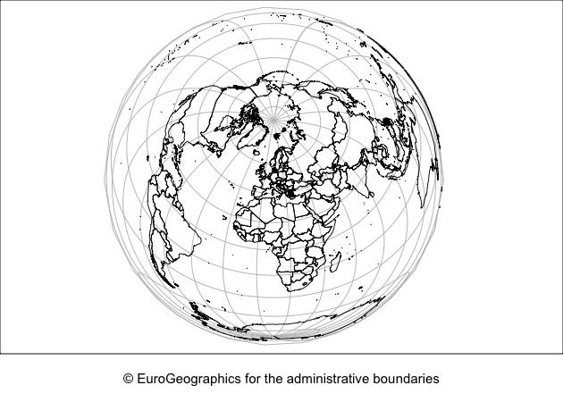

<!-- README.md is generated from README.Rmd. Please edit that file -->

# giscoR 

<!-- badges: start -->

[](https://CRAN.R-project.org/package=giscoR)
 [](https://travis-ci.com/dieghernan/giscoR)
[](https://github.com/dieghernan/giscoR/actions)
[](https://ci.appveyor.com/project/dieghernan/giscoR)
[](https://codecov.io/gh/dieghernan/giscoR)
[](https://www.tidyverse.org/lifecycle/#maturing)
<!-- badges: end -->

[giscoR](https://dieghernan.github.io/giscoR/) is a API package that
helps to retrieve data from [Eurostat - GISCO (the Geographic
Information System of the
COmmission)](https://ec.europa.eu/eurostat/web/gisco). It also provides
some lightweight data sets ready to use without downloading. Currently
only the [Administrative Units / Statistical
Units](https://ec.europa.eu/eurostat/web/gisco/geodata/reference-data/administrative-units-statistical-units)
data sets are supported.

GISCO [(FAQ)](https://ec.europa.eu/eurostat/web/gisco/faq) is a
geospatial open data repository including several data sets as
countries, coastal lines, labels or [NUTS
levels](https://ec.europa.eu/eurostat/web/regions-and-cities/overview).
The data sets are usually provided at several resolution levels
(60M/20M/10M/03M/01M) and in 3 different projections (4326/3035/3857).

Note that the package does not provide metadata on the downloaded files,
the information is available on the [API
webpage](https://gisco-services.ec.europa.eu/distribution/v2/).

## Installation

Install `giscoR` from
[**CRAN**](https://CRAN.R-project.org/package=giscoR):

``` r
install.packages("giscoR")
```

You can install the developing version of `giscoR` with:

``` r

library(remotes)
install_github("dieghernan/giscoR")
```

## Usage

This script highlights some features of `giscoR`:

``` r

library(giscoR)
library(sf)

# Different resolutions
DNK_res60 <- gisco_get_countries(resolution = "60", country = "DNK")
DNK_res20 <-
  gisco_get_countries(resolution = "20", country = "DNK")
DNK_res10 <-
  gisco_get_countries(resolution = "10", country = "DNK")
DNK_res03 <-
  gisco_get_countries(resolution = "03", country = "DNK")

opar <- par(no.readonly = TRUE)
par(mfrow = c(2, 2), mar = c(3, 0, 2, 0))
plot(st_geometry(DNK_res60), main = "60M", col = "tomato")
plot(st_geometry(DNK_res20), main = "20M", col = "tomato")
plot(st_geometry(DNK_res10), main = "10M", col = "tomato")
plot(st_geometry(DNK_res03), main = "03M", col = "tomato")
title(sub = gisco_attributions(), line = 1)
```

<!-- -->

``` r
par(opar)

# Different projections
cntr_4326 <- gisco_get_countries(epsg = "4326")
cntr_3857 <- gisco_get_countries(epsg = "3857")
cntr_3035 <- gisco_get_countries(epsg = "3035")

opar <- par(no.readonly = TRUE)
par(mar = c(3, 0, 0, 0))

# epsg 4326
g1 <- st_graticule(cntr_4326, lon = seq(-180, 180, 20), lat = seq(-90, 90, 20))

plot(st_geometry(cntr_4326), col = "bisque", graticule = g1)
title(sub = gisco_attributions(), line = 1)
```

<!-- -->

``` r


# epsg 3857
g2 <- st_graticule(cntr_3857, lon = seq(-180, 180, 20), lat = seq(-90, 90, 20))
plot(
  st_geometry(cntr_3857),
  col = "bisque",
  graticule = g2,
  ylim = c(-13000000, 13000000)
)
title(sub = gisco_attributions(), line = 1)
```

<!-- -->

``` r

# epsg 3035
g3 <- st_graticule(cntr_3035, lon = seq(-180, 180, 20), lat = seq(-90, 90, 20))
plot(st_geometry(cntr_3035), col = "bisque", graticule = g3)
title(sub = gisco_attributions(), line = 1)
```

<!-- -->

``` r
par(opar)


# Labels and Lines available
labs <- gisco_get_countries(spatialtype = "LB", region = "Africa", epsg = "3857")
coast <- gisco_get_countries(spatialtype = "COASTL", epsg = "3857")

opar <- par(no.readonly = TRUE)
par(mar = c(3, 0, 0, 0))
plot(st_geometry(labs),
  col = c("springgreen4", "darkgoldenrod1", "red2"), cex = 2,
  pch = 19
)
plot(st_geometry(coast), col = "deepskyblue4", lwd = 6, add = TRUE)
title(sub = gisco_attributions(), line = 1)
```

<!-- -->

``` r
par(opar)
```

### A note on caching

Some data sets (as Local Administrative Units - LAU, or high-resolution
files) may have a size larger than 50MB. You can use `giscoR` to create
your own local repository at a given local directory passing the
following option:

``` r
options(gisco_cache_dir = "./path/to/location")
```

When this option is set, `giscoR` would look for the cached file and it
will load it, speeding up the process.

You can also download manually the files (`.geojson` format) and store
them on your local directory.

## Recommended packages

### API data packages

`wbstats` (<https://nset-ornl.github.io/wbstats/>) is an interesting R
API packages that provides access to [The World Bank
Data](https://data.worldbank.org/) API.

### Plotting `sf` objects

Some packages recommended for visualization are:

  - [`tmap`](https://mtennekes.github.io/tmap/)  
  - [`cartography`](http://riatelab.github.io/cartography/docs/)
  - [`ggplot2`](https://github.com/tidyverse/ggplot2) +
    [`ggspatial`](https://github.com/paleolimbot/ggspatial)
  - [`leaflet`](https://rstudio.github.io/leaflet/)

## Contribute

Check the Github page for [source
code](https://github.com/dieghernan/giscoR/).

Contributions are very welcome:

  - [Use issue tracker](https://github.com/dieghernan/giscoR/issues) for
    feedback and bug reports.
  - [Send pull requests](https://github.com/dieghernan/giscoR/)
  - [Star us on the Github page](https://github.com/dieghernan/giscoR)

## Copyright notice

*From GISCO \> Geodata \> Reference data \> Administrative Units /
Statistical Units*

When data downloaded from this page is used in any printed or electronic
publication, in addition to any other provisions applicable to the whole
Eurostat website, data source will have to be acknowledged in the legend
of the map and in the introductory page of the publication with the
following copyright notice:

EN: © EuroGeographics for the administrative boundaries

FR: © EuroGeographics pour les limites administratives

DE: © EuroGeographics bezüglich der Verwaltungsgrenzen

For publications in languages other than English, French or German, the
translation of the copyright notice in the language of the publication
shall be used.

If you intend to use the data commercially, please contact
EuroGeographics for information regarding their licence agreements.

## Disclaimer

This package is in no way officially related to or endorsed by Eurostat.
