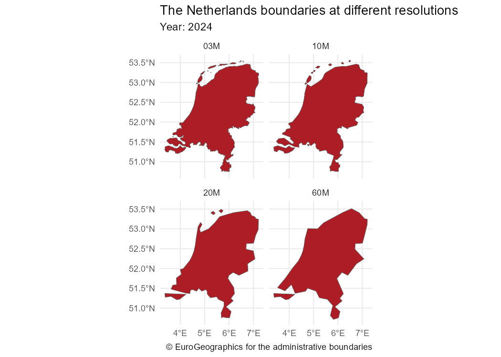
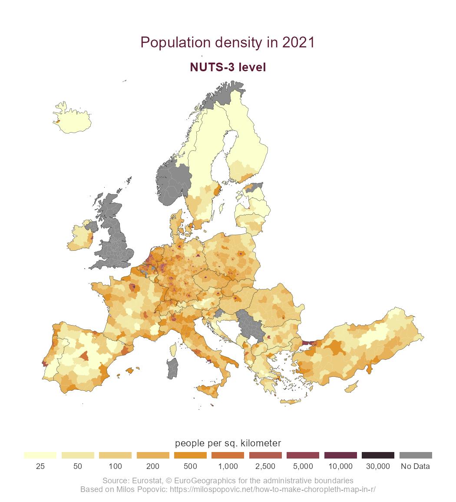

<!-- README.md is generated from README.Rmd. Please edit that file -->

# giscoR <a href='https://ropengov.github.io/giscoR/'></a>

<!-- badges: start -->

[](https://ropengov.org/)
[](https://CRAN.R-project.org/package=giscoR)
[](https://cran.r-project.org/web/checks/check_results_giscoR.html)
[](https://CRAN.R-project.org/package=giscoR)
[](https://ropengov.r-universe.dev/giscoR)
[](https://github.com/rOpenGov/giscoR/actions/workflows/check-full.yaml)
[](https://github.com/rOpenGov/giscoR/actions/workflows/rhub.yaml)
[](https://app.codecov.io/gh/ropengov/giscoR)
[](https://www.codefactor.io/repository/github/ropengov/giscor)
[](https://doi.org/10.32614/CRAN.package.giscoR)
[](https://www.repostatus.org/#active)

<!-- badges: end -->

[**giscoR**](https://ropengov.github.io/giscoR//) is an **R** package
that provides a simple interface to
[GISCO](https://ec.europa.eu/eurostat/web/gisco) data from Eurostat. It
allows you to download and work with global and European geospatial
datasets — such as country boundaries, NUTS regions, coastlines, and
labels — directly in **R**.

## Key features

- Retrieve **GISCO files** for countries, regions, and administrative
  units.
- Access data at multiple resolutions: `60M`, `20M`, `10M`, `03M`,
  `01M`.
- Choose from three projections: **EPSG 4326**, **3035**, or **3857**.
- Works seamlessly with **sf** objects for spatial analysis.
- Includes **caching** for faster repeated access.

## Installation

Install **giscoR** from
[**CRAN**](https://CRAN.R-project.org/package=giscoR):

``` r
install.packages("giscoR")
```

You can install the development version of **giscoR** with:

``` r
# install.packages("pak")

pak::pak("rOpenGov/giscoR")
```

Alternatively, you can install **giscoR** via
[r-universe](https://ropengov.r-universe.dev/giscoR):

``` r
install.packages("giscoR", repos = c("https://ropengov.r-universe.dev", "https://cloud.r-project.org"))
```

## Quick Example

This script highlights some features of **giscoR** :

``` r
library(giscoR)
library(sf)
library(dplyr)

# Download The Netherlands boundaries at different resolutions
nl_all <- lapply(c("60", "20", "10", "03"), function(r) {
  gisco_get_countries(country = "Netherlands", year = 2024, resolution = r) |>
    mutate(res = paste0(r, "M"))
}) |>
  bind_rows()

glimpse(nl_all)
#> Rows: 4
#> Columns: 13
#> $ CNTR_ID   <chr> "NL", "NL", "NL", "NL"
#> $ CNTR_NAME <chr> "Nederland", "Nederland", "Nederland", "Nederland"
#> $ NAME_ENGL <chr> "Netherlands", "Netherlands", "Netherlands", "Netherlands"
#> $ NAME_FREN <chr> "Pays-Bas", "Pays-Bas", "Pays-Bas", "Pays-Bas"
#> $ ISO3_CODE <chr> "NLD", "NLD", "NLD", "NLD"
#> $ SVRG_UN   <chr> "UN Member State", "UN Member State", "UN Member State", "UN…
#> $ CAPT      <chr> "Amsterdam", "Amsterdam", "Amsterdam", "Amsterdam"
#> $ EU_STAT   <chr> "T", "T", "T", "T"
#> $ EFTA_STAT <chr> "F", "F", "F", "F"
#> $ CC_STAT   <chr> "F", "F", "F", "F"
#> $ NAME_GERM <chr> "Niederlande", "Niederlande", "Niederlande", "Niederlande"
#> $ geometry  <MULTIPOLYGON [°]> MULTIPOLYGON (((7.208935 53..., MULTIPOLYGON (((7.202794 53.…
#> $ res       <chr> "60M", "20M", "10M", "03M"

# Plot with ggplot2

library(ggplot2)

ggplot(nl_all) +
  geom_sf(fill = "#AD1D25") +
  facet_wrap(~res) +
  labs(
    title = "The Netherlands boundaries at different resolutions",
    subtitle = "Year: 2024",
    caption = gisco_attributions()
  ) +
  theme_minimal()
```



## Advanced Example: Thematic maps

This example shows a thematic map created with the **ggplot2** package.
The data are obtained via the **eurostat** package. This follows the
approach presented by [Milos Popovic](https://milospopovic.net/) in
[this post](https://milospopovic.net/how-to-make-choropleth-map-in-r/).

We start by extracting the corresponding geographic data:

``` r
library(giscoR)
library(dplyr)
library(eurostat)
library(ggplot2)

# Get sf objects
nuts3 <- gisco_get_nuts(
  year = 2021,
  epsg = 3035,
  resolution = 10,
  nuts_level = 3
)

# Get country lines (NUTS 0 level)

country_lines <- gisco_get_nuts(
  year = 2021,
  epsg = 3035,
  resolution = 10,
  spatialtype = "BN",
  nuts_level = 0
)
```

We now download the data from Eurostat:

``` r
# Use eurostat
popdens <- get_eurostat("demo_r_d3dens") |>
  filter(TIME_PERIOD == "2021-01-01")
```

Finally, we merge and manipulate the data to create the final plot:

``` r
# Merge data
nuts3_sf <- nuts3 |>
  left_join(popdens, by = "geo")

# Breaks and labels
br <- c(0, 25, 50, 100, 200, 500, 1000, 2500, 5000, 10000, 30000)
labs <- prettyNum(br[-1], big.mark = ",")

# Label function used in the plot, mainly for NAs
labeller_plot <- function(x) {
  ifelse(is.na(x), "No Data", x)
}
nuts3_sf <- nuts3_sf |>
  # Cut with labels
  mutate(values_cut = cut(values, br, labels = labs))


# Palette
pal <- hcl.colors(length(labs), "Lajolla")


# Plot
ggplot(nuts3_sf) +
  geom_sf(aes(fill = values_cut), linewidth = 0, color = NA, alpha = 0.9) +
  geom_sf(data = country_lines, col = "black", linewidth = 0.1) +
  # Center in Europe: EPSG 3035
  coord_sf(
    xlim = c(2377294, 7453440),
    ylim = c(1313597, 5628510)
  ) +
  # Legends
  scale_fill_manual(
    values = pal,
    # Label for NA
    labels = labeller_plot,
    drop = FALSE, guide = guide_legend(direction = "horizontal", nrow = 1)
  ) +
  # Theming
  theme_void() +
  # Theme
  theme(
    plot.title = element_text(
      color = rev(pal)[2], size = rel(1.5),
      hjust = 0.5, vjust = -6
    ),
    plot.subtitle = element_text(
      color = rev(pal)[2], size = rel(1.25),
      hjust = 0.5, vjust = -10, face = "bold"
    ),
    plot.caption = element_text(color = "grey60", hjust = 0.5, vjust = 0),
    legend.text = element_text(color = "grey20", hjust = .5),
    legend.title = element_text(color = "grey20", hjust = .5),
    legend.position = "bottom",
    legend.title.position = "top",
    legend.text.position = "bottom",
    legend.key.height = unit(.5, "line"),
    legend.key.width = unit(2.5, "line")
  ) +
  # Annotate and labs
  labs(
    title = "Population density in 2021",
    subtitle = "NUTS-3 level",
    fill = "people per sq. kilometer",
    caption = paste0(
      "Source: Eurostat, ", gisco_attributions(),
      "\nBased on Milos Popovic: ",
      "https://milospopovic.net/how-to-make-choropleth-map-in-r/"
    )
  )
```



## Caching

Large datasets (e.g., LAU or high-resolution files) can exceed 50MB.
Use:

``` r
gisco_set_cache_dir("./path/to/location")
```

Files will be stored locally for faster access.

## Contribute

Check the GitHub page for [source
code](https://github.com/rOpenGov/giscoR/).

Contributions are welcome:

- [Use issue tracker](https://github.com/rOpenGov/giscoR/issues) for
  feedback and bug reports.
- [Send pull requests](https://github.com/rOpenGov/giscoR/)
- [Star us on the GitHub page](https://github.com/rOpenGov/giscoR)

## Citation

To cite ‘giscoR’ in publications use:

Hernangómez D (2026). *giscoR: Download Map Data from GISCO API -
Eurostat*. <doi:10.32614/CRAN.package.giscoR>
<https://doi.org/10.32614/CRAN.package.giscoR>,
<https://ropengov.github.io/giscoR/>.

A BibTeX entry for LaTeX users is

    @Manual{R-giscoR,
      title = {{giscoR}: Download Map Data from GISCO API - Eurostat},
      doi = {10.32614/CRAN.package.giscoR},
      author = {Diego Hernangómez},
      year = {2026},
      version = {1.0.1},
      url = {https://ropengov.github.io/giscoR/},
      abstract = {Tools to download data from the GISCO (Geographic Information System of the Commission) Eurostat database <https://ec.europa.eu/eurostat/web/gisco>. Global and European map data available. This package is in no way officially related to or endorsed by Eurostat.},
    }

## General copyright

> [Eurostat’s general copyright notice and licence
> policy](https://ec.europa.eu/eurostat/web/main/help/copyright-notice)
> applies. Moreover, there are specific rules that apply to some of the
> following datasets available for downloading. The download and use of
> these data are subject to these rules being accepted. See our
> [administrative
> units](https://ec.europa.eu/eurostat/web/gisco/geodata/administrative-units)
> and [statistical
> units](https://ec.europa.eu/eurostat/web/gisco/geodata/statistical-units)
> for more details.
>
> Source: <https://ec.europa.eu/eurostat/web/gisco/geodata>

## Disclaimer

This package is neither affiliated with nor endorsed by Eurostat. The
authors are not responsible for any misuse of the data.
