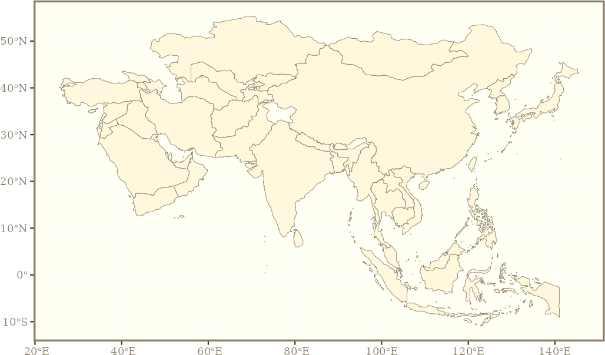
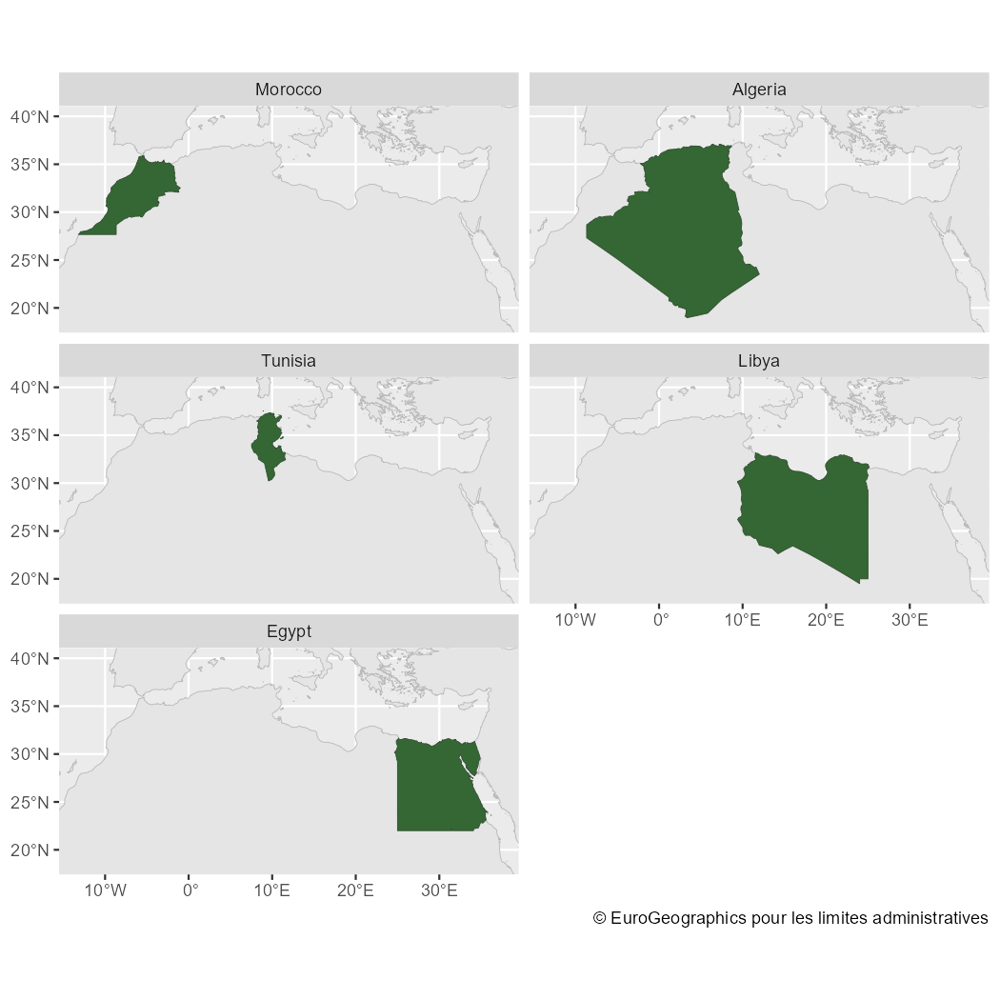

# Get started with giscoR

## Introduction

*Full site with more examples and vignettes on
<https://ropengov.github.io/giscoR/>*

[**giscoR**](https://ropengov.github.io/giscoR/) is a package designed
to provide a clean interaction with the [GISCO
API](https://gisco-services.ec.europa.eu/distribution/v2/).

Within Eurostat, GISCO is responsible for meeting the European
Commission’s geographical information needs at 3 levels: the European
Union, its member countries, and its regions. GISCO also provides a
variety of shapefiles on different formats, focusing specially in the
European Union area, but providing also some worldwide shapefiles, as
country polygons, labels or borders and coastal lines.

GISCO provides data on different resolutions suitable for representing
small areas (01M, 03M) as well as lightweight datasets specially useful
for representing wider areas (10M, 20M, 60M). Shapefiles are provided on
3 different projections: EPSG 4326, 3035 or 3857.

**giscoR** returns
[`sf`](https://r-spatial.github.io/sf/reference/sf.html) class objects,
see <https://r-spatial.github.io/sf/>.

## Caching

**giscoR** provides a dataset caching capability, that could be set as:

``` r
gisco_set_cache_dir("./path/to/location")
```

If the file is not available locally, it would be downloaded to that
directory so the next time you need the corresponding data it would be
loaded from the local directory.

If you experience any problems on downloading, you can also manually
download the file from the [GISCO API
website](https://gisco-services.ec.europa.eu/distribution/v2/) and store
it on your local directory.

## Downloading data

Please be aware that downloading provisions apply when using GISCO data:

> When data downloaded from this page is used in any printed or
> electronic publication, in addition to any other provisions applicable
> to the whole Eurostat website, data source will have to be
> acknowledged in the legend of the map and in the introductory page of
> the publication with the following copyright notice:
>
> - EN: © EuroGeographics for the administrative boundaries
> - FR: © EuroGeographics pour les limites administratives
> - DE: © EuroGeographics bezüglich der Verwaltungsgrenzen
>
> For publications in languages other than English, French or German,
> the translation of the copyright notice in the language of the
> publication shall be used.
>
> If you intend to use the data commercially, please contact
> **EuroGeographics** for information regarding their licence
> agreements.

There is a function,
[`gisco_attributions()`](https://ropengov.github.io/giscoR/dev/reference/gisco_attributions.md)
that would guide you on this topic. It also provides attributions on
several languages.

``` r
library(giscoR)
gisco_attributions(lang = "en")
#> [1] "© EuroGeographics for the administrative boundaries"
gisco_attributions(lang = "fr")
#> [1] "© EuroGeographics pour les limites administratives"
gisco_attributions(lang = "de")
#> [1] "© EuroGeographics bezüglich der Verwaltungsgrenzen"
```

## Basic example

Some examples on data downloads

``` r
library(sf)
library(ggplot2) # Use ggplot for plotting

asia <- gisco_get_countries(region = "Asia")

ggplot(asia) +
  geom_sf(fill = "cornsilk", color = "#887e6a") +
  theme(
    panel.background = element_rect(fill = "#fffff3"),
    panel.border = element_rect(colour = "#887e6a", fill = NA, linewidth = 1.5),
    axis.text = element_text(
      family = "serif", colour = "#887e6a",
      face = "bold"
    )
  )
```



Political map of Asia

You can select specific countries by name (in any language), ISO 3 codes
or Eurostat codes. The only restriction is that you can’t mix country
names, ISO3 and Eurostat codes on one single call.

It is possible also to combine different shapefiles, just set
`resolution` and `epsg` (and optionally `year`) to the same value:

``` r
africa_north <- gisco_get_countries(
  country = c(
    "Morocco", "Argelia", "Libia",
    "Tunisia", "Egypt"
  ),
  resolution = "20", epsg = "4326", year = "2016"
)

# Coastal lines

coast <- gisco_get_coastal_lines(
  resolution = "20",
  epsg = "4326",
  year = "2016"
)

# Plot
ggplot(coast) +
  geom_sf(color = "grey80") +
  geom_sf(data = africa_north, fill = "grey30", color = "white") +
  coord_sf(xlim = c(-13, 37), ylim = c(18.5, 40)) +
  facet_wrap(vars(NAME_ENGL), ncol = 2)
```



Political map of North Africa

## Thematic maps with **giscoR**

This is an example on how **giscoR** can play nicely with some Eurostat
data. For plotting purposes we would use the
[**ggplot2**](https://CRAN.R-project.org/package=ggplot2) package
however any package that handles `sf` objects (e.g.
[**tmap**](https://CRAN.R-project.org/package=tmap),
[**mapsf**](https://CRAN.R-project.org/package=mapsf),
[**leaflet**](https://CRAN.R-project.org/package=leaflet), etc. could be
used).

Also [**colorspace**](https://CRAN.R-project.org/package=colorspace) and
[**rcartocolor**](https://CRAN.R-project.org/package=rcartocolor)
packages are recommended, as they provide great color palettes.

``` r
# EU members
library(dplyr)
library(eurostat)

nuts2 <- gisco_get_nuts(
  year = "2021", epsg = "3035", resolution = "10",
  nuts_level = "2"
)
# Borders from countries
borders <- gisco_get_countries(epsg = "3035", year = "2020", resolution = "3")

eu_bord <- borders |>
  filter(CNTR_ID %in% nuts2$CNTR_CODE)

# Eurostat data - Disposable income
pps <- get_eurostat("tgs00026") |>
  filter(TIME_PERIOD == "2021-01-01")

nuts2_sf <- nuts2 |>
  left_join(pps, by = "geo") |>
  mutate(
    values_th = values / 1000,
    categ = cut(values_th, c(0, 15, 30, 60, 90, 120, Inf))
  )


# Adjust the labels
labs <- levels(nuts2_sf$categ)
labs[1] <- "< 15"
labs[6] <- "> 120"
levels(nuts2_sf$categ) <- labs


# Finally the plot
ggplot(nuts2_sf) +
  # Background
  geom_sf(data = borders, fill = "#e1e1e1", color = NA) +
  geom_sf(aes(fill = categ), color = "grey20", linewidth = .1) +
  geom_sf(data = eu_bord, fill = NA, color = "black", linewidth = .15) +
  # Center in Europe: EPSG 3035
  coord_sf(xlim = c(2377294, 6500000), ylim = c(1413597, 5228510)) +
  # Legends and color
  scale_fill_manual(
    values = hcl.colors(length(labs), "Geyser", rev = TRUE),
    # Label NA
    labels = function(x) {
      ifelse(is.na(x), "No Data", x)
    },
    na.value = "#e1e1e1"
  ) +
  guides(fill = guide_legend(nrow = 1)) +
  theme_void() +
  theme(
    text = element_text(colour = "grey0"),
    panel.background = element_rect(fill = "#97dbf2"),
    panel.border = element_rect(fill = NA, color = "grey10"),
    plot.title = element_text(hjust = 0.5, vjust = -1, size = 12),
    plot.subtitle = element_text(
      hjust = 0.5, vjust = -2, face = "bold",
      margin = margin(b = 10, t = 5), size = 12
    ),
    plot.caption = element_text(
      size = 8, hjust = 0.5, margin =
        margin(b = 2, t = 13)
    ),
    legend.text = element_text(size = 7, ),
    legend.title = element_text(size = 7),
    legend.position = "bottom",
    legend.direction = "horizontal",
    legend.text.position = "bottom",
    legend.title.position = "top",
    legend.key.height = rel(0.5),
    legend.key.width = unit(.1, "npc")
  ) +
  # Annotate and labels
  labs(
    title = "Disposable income of private households (2021)",
    subtitle = "NUTS-2 level",
    fill = "euros (thousands)",
    caption = paste0(
      "Source: Eurostat\n ", gisco_attributions()
    )
  )
```


Disposable income of private households by NUTS 2 regions (2021)
