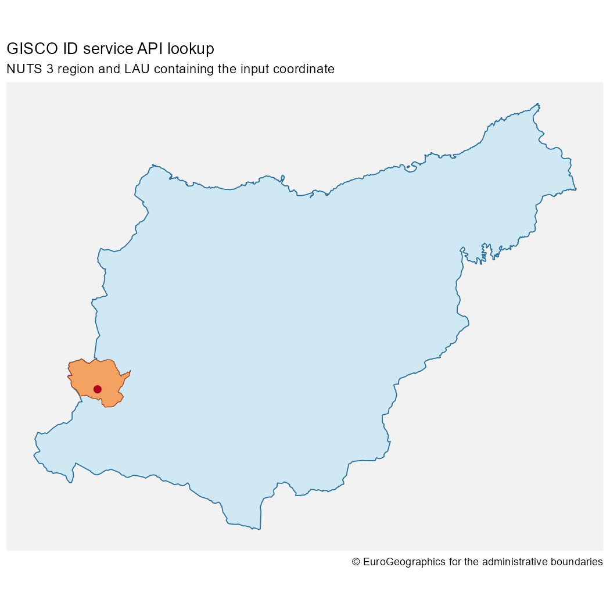
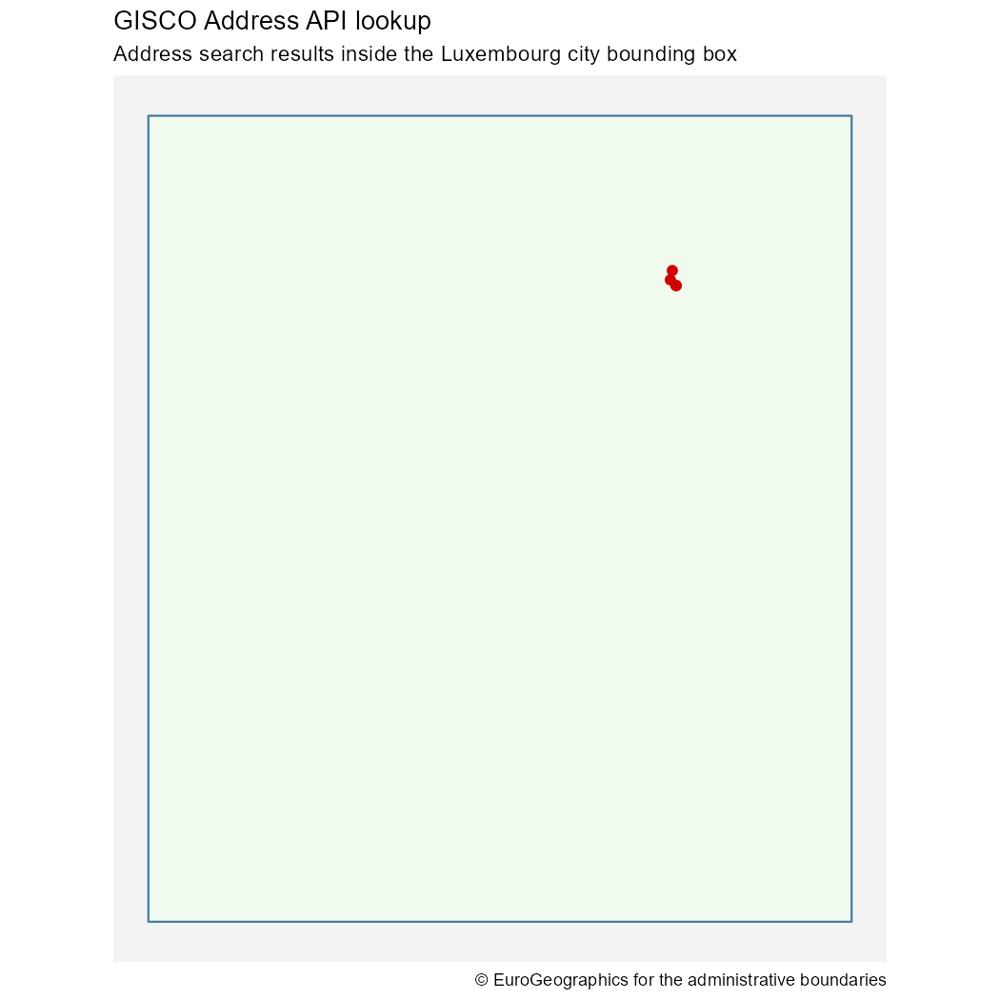

<!-- apis.qmd is generated from apis.qmd.orig. Please edit that file -->


# Overview

Most **giscoR** workflows should start with the higher-level download functions,
such as `gisco_get_countries()`, `gisco_get_nuts()` or
`gisco_get_lau()`. These functions download complete GISCO datasets and return
[`sf`](https://r-spatial.github.io/sf/reference/sf.html) objects that can be
filtered, joined and mapped locally.

The GISCO APIs are useful when a workflow starts from a coordinate, address or
identifier and you need a targeted lookup instead of a complete dataset.
**giscoR** includes wrappers for two API families:

- `gisco_id_api_*()` functions query the GISCO ID service API.
- `gisco_address_api_*()` functions query the GISCO Address API.

These functions use live GISCO services. Results can change as services and
source datasets are updated, and unavailable services return `NULL`.

# GISCO ID service API

The GISCO ID service API identifies GISCO features from coordinates or IDs. It
is useful when you have a point location and need to know which NUTS region,
LAU, country, river basin, biogeographical region or census grid cell contains
it.

For example, the following code queries the Basque Country coordinates used in
the package examples and compares the matching NUTS and LAU geometries.


``` r
library(giscoR)
library(ggplot2)

x <- -2.5
y <- 43.06

nuts3 <- gisco_id_api_nuts(x = x, y = y, nuts_level = 3)
lau <- gisco_id_api_lau(x = x, y = y)
place <- sf::st_as_sf(
  data.frame(name = "Input coordinate", x = x, y = y),
  coords = c("x", "y"),
  crs = 4326
)
```

Most ID service wrappers can return either geometry or attributes. Use
`geometry = FALSE` when you only need identifiers and metadata:


``` r
nuts <- gisco_id_api_nuts(
  x = x,
  y = y,
  nuts_level = 3,
  geometry = FALSE
)

nuts
#> # A tibble: 1 × 3
#>   id    stat_levl_code OBJECTID
#>   <chr>          <int> <chr>   
#> 1 ES212              3 ES212
```

Use `geometry = TRUE`, the default, when you want an `sf` object suitable for
mapping.


``` r
ggplot(nuts3) +
  geom_sf(fill = "#cfe8f3", color = "#2a6f97", linewidth = 0.4) +
  geom_sf(data = lau, fill = "#f4a261", color = "#9c4221", linewidth = 0.3) +
  geom_sf(data = place, color = "#b00020", size = 2.5) +
  coord_sf() +
  theme_minimal() +
  theme(
    panel.background = element_rect(fill = "grey95", color = NA),
    axis.line = element_blank(),
    axis.text = element_blank(),
    panel.grid = element_blank()
  ) +
  labs(
    title = "GISCO ID service API lookup",
    subtitle = "NUTS 3 region and LAU containing the input coordinate",
    caption = gisco_attributions()
  )
```

<div class="figure">

<p class="caption">NUTS 3 and LAU geometries returned by the GISCO ID service API</p>
</div>

You can also query NUTS regions by ID:


``` r
gisco_id_api_nuts(nuts_id = "ES21", nuts_level = 2)
#> Simple feature collection with 1 feature and 1 field
#> Geometry type: POINT
#> Dimension:     XY
#> Bounding box:  xmin: -2.616427 ymin: 43.0433 xmax: -2.616427 ymax: 43.0433
#> Geodetic CRS:  WGS 84
#> # A tibble: 1 × 2
#>   nuts_id            geometry
#> * <chr>           <POINT [°]>
#> 1 ES21    (-2.616427 43.0433)
```

# GISCO Address API

The GISCO Address API supports address search, reverse geocoding and lookup of
available administrative address components. It can be useful when a workflow
starts with a human-readable address rather than a GISCO feature ID.

Use the lookup helpers to inspect available address components:


``` r
gisco_address_api_countries()
#> # A tibble: 31 × 1
#>    L0   
#>    <chr>
#>  1 AT   
#>  2 BE   
#>  3 BG   
#>  4 CH   
#>  5 CY   
#>  6 CZ   
#>  7 DE   
#>  8 DK   
#>  9 EE   
#> 10 EL   
#> # ℹ 21 more rows
gisco_address_api_provinces(country = "LU")
#> # A tibble: 12 × 1
#>    L1              
#>    <chr>           
#>  1 CAPELLEN        
#>  2 CLERVAUX        
#>  3 DIEKIRCH        
#>  4 ECHTERNACH      
#>  5 ESCH-SUR-ALZETTE
#>  6 GREVENMACHER    
#>  7 LUXEMBOURG      
#>  8 MERSCH          
#>  9 REDANGE         
#> 10 REMICH          
#> 11 VIANDEN         
#> 12 WILTZ
gisco_address_api_cities(country = "LU")
#> # A tibble: 542 × 1
#>    L2        
#>    <chr>     
#>  1 ABWEILER  
#>  2 AHN       
#>  3 ALLERBORN 
#>  4 ALSCHEID  
#>  5 ALTLINSTER
#>  6 ALTRIER   
#>  7 ALTWIES   
#>  8 ALZINGEN  
#>  9 ANGELSBERG
#> 10 ANSEMBOURG
#> # ℹ 532 more rows
gisco_address_api_roads(country = "LU", province = "Capellen", city = "Dippach")
#> # A tibble: 16 × 2
#>    TF                      PC   
#>    <chr>                   <chr>
#>  1 BEIM WAASSERTUERM       4972 
#>  2 ECKERBIERG              4974 
#>  3 IM INBERG               4974 
#>  4 OP WAISSE MUOR          4974 
#>  5 ROUTE DE LUXEMBOURG     4972 
#>  6 ROUTE DE LUXEMBOURG     4973 
#>  7 ROUTE DES TROIS CANTONS 4972 
#>  8 RUE BELLE-VUE           4974 
#>  9 RUE CENTRALE            4974 
#> 10 RUE DE BETTANGE         4974 
#> 11 RUE DE HOLZEM           4974 
#> 12 RUE DE LA FONTAINE      4974 
#> 13 RUE DES ROMAINS         4974 
#> 14 RUE DU CIMETIÈRE        4974 
#> 15 RUE JEAN-PIERRE KIRSCH  4974 
#> 16 SAUER AARBECHT          4974
```

Use `gisco_address_api_search()` for structured geocoding. Search endpoints
support approximate string matching, so exact spelling is not always required.
The bounding-box endpoint can provide context for the returned address points.


``` r
address <- gisco_address_api_search(
  country = "LU",
  city = "Luxembourg",
  road = "Rue Alphonse Weicker"
)

bbox <- gisco_address_api_bbox(
  country = "LU",
  city = "Luxembourg"
)
```

Search, reverse and bounding-box calls return `sf` objects. If a search result
contains coordinates, they can be passed to the reverse endpoint:


``` r
gisco_address_api_reverse(
  x = address$X[1],
  y = address$Y[1],
  country = "LU"
)
#> Simple feature collection with 5 features and 14 fields
#> Geometry type: POINT
#> Dimension:     XY
#> Bounding box:  xmin: 6.16786 ymin: 49.6315 xmax: 6.169307 ymax: 49.63328
#> Geodetic CRS:  WGS 84
#> # A tibble: 5 × 15
#>   LD    TF     L2    L1    L0    I3    PC    N0    N1    N2    N3    OL        X
#> * <chr> <chr>  <chr> <chr> <chr> <chr> <chr> <chr> <chr> <chr> <chr> <chr> <dbl>
#> 1 4     RUE A… LUXE… LUXE… LU    LUX   2721  LU    LU0   LU00  LU000 8FX8…  6.17
#> 2 3     RUE J… LUXE… LUXE… LU    LUX   2180  LU    LU0   LU00  LU000 8FX8…  6.17
#> 3 41B   AVENU… LUXE… LUXE… LU    LUX   1855  LU    LU0   LU00  LU000 8FX8…  6.17
#> 4 2     RUE J… LUXE… LUXE… LU    LUX   2180  LU    LU0   LU00  LU000 8FX8…  6.17
#> 5 5     RUE A… LUXE… LUXE… LU    LUX   2721  LU    LU0   LU00  LU000 8FX8…  6.17
#> # ℹ 2 more variables: Y <dbl>, geometry <POINT [°]>
```

Use the returned geometries directly with **ggplot2**:


``` r
ggplot(bbox) +
  geom_sf(fill = "#f1faee", color = "#457b9d", linewidth = 0.5) +
  geom_sf(data = address, color = "#d00000", size = 2) +
  coord_sf() +
  theme_minimal() +
  theme(
    panel.background = element_rect(fill = "grey95", color = NA),
    axis.line = element_blank(),
    axis.text = element_blank(),
    panel.grid = element_blank()
  ) +
  labs(
    title = "GISCO Address API lookup",
    subtitle = "Address search results inside the Luxembourg city bounding box",
    caption = gisco_attributions()
  )
```

<div class="figure">

<p class="caption">Structured address search result and city bounding box</p>
</div>

# Choosing between APIs and downloads

Use download functions when you need complete datasets:

```r
countries <- gisco_get_countries(year = 2024)
nuts <- gisco_get_nuts(year = 2024, nuts_level = 2)
```

Use API functions when you need targeted answers:

- Which NUTS region contains this coordinate?
- Which LAU contains this coordinate?
- What address is closest to this coordinate?
- Which address components are available for a country, province or city?

For repeated spatial analysis over many records, downloading a full dataset and
joining locally is often more robust than making one API request per row. API
requests are best suited to interactive lookup, validation and small batches.

# Defensive use

API services are remote dependencies. In scripts, check for `NULL` before using
the result:

```r
res <- gisco_id_api_country(x = x, y = y)

if (is.null(res)) {
  message("The GISCO ID service API did not return a result.")
} else {
  res
}
```

In packages or tests, skip API-dependent checks when GISCO is not reachable.
For reproducible workflows, keep API calls close to the point where the result
is needed and avoid assuming that live services will always return exactly the
same number of rows.
