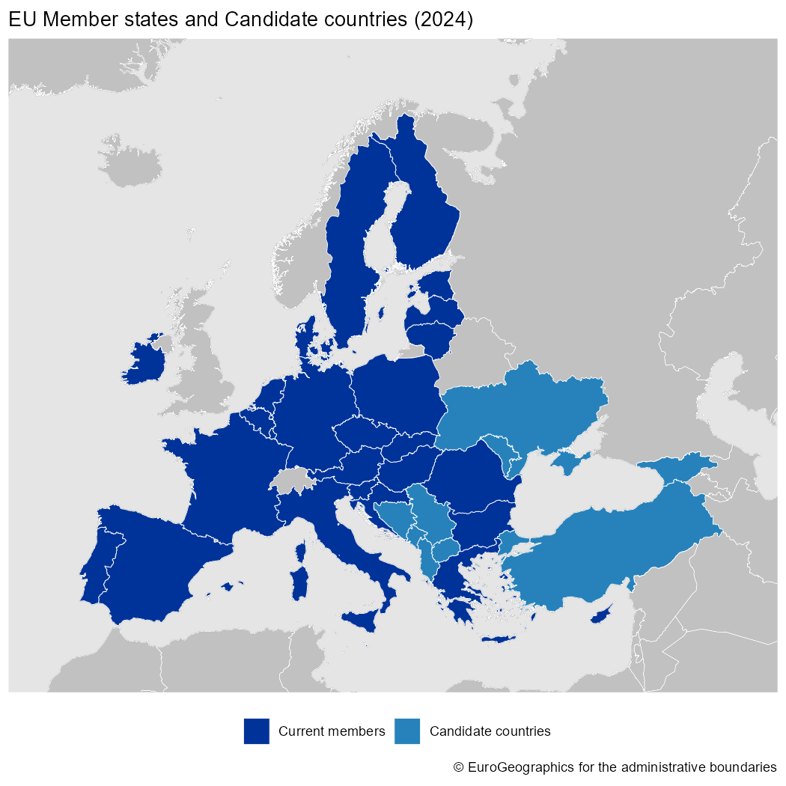
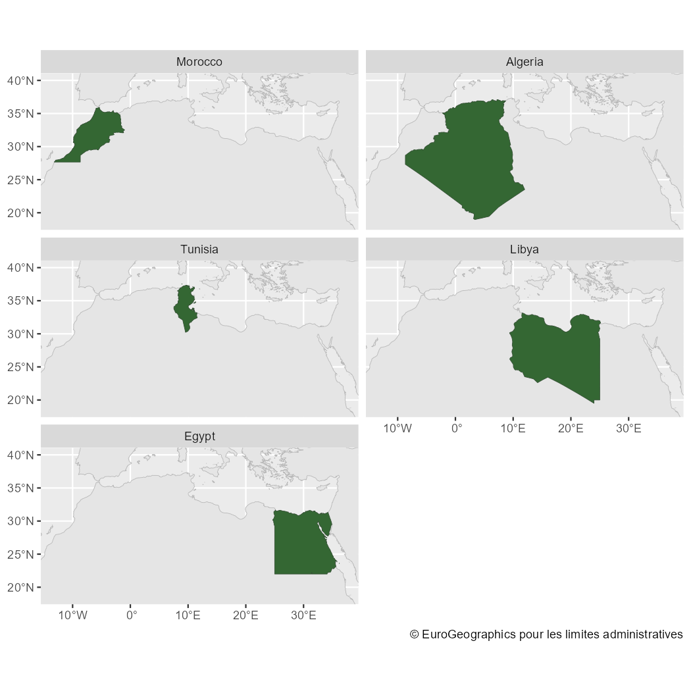
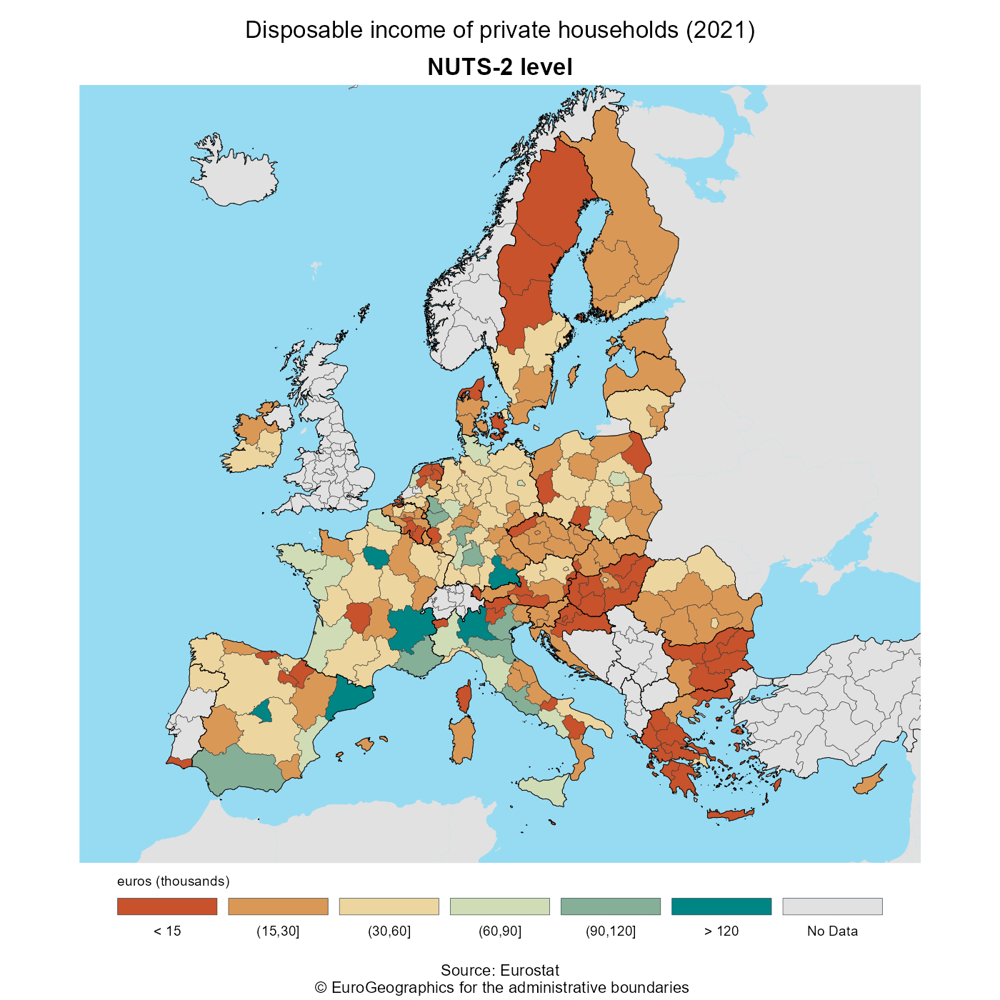

# Introduction

*Full site with more examples and vignettes on
<https://ropengov.github.io/giscoR/>*

[**giscoR**](https://ropengov.github.io/giscoR/) is a package designed to
provide a clean interaction with the [GISCO
API](https://gisco-services.ec.europa.eu/distribution/v2/).

Within Eurostat, GISCO is responsible for meeting the European Commission's
geographical information needs at 3 levels: the European Union, its member
countries, and its regions. GISCO also provides a variety of shapefiles on
different formats, focusing specially in the European Union area, but providing
also some worldwide shapefiles, as country polygons, labels or borders and
coastal lines.

GISCO provides data on different resolutions suitable for representing small
areas (01M, 03M) as well as lightweight datasets specially useful for
representing wider areas (10M, 20M, 60M). Shapefiles are provided on 3 different
projections: EPSG 4326, 3035 or 3857.

**giscoR** returns `sf` objects, so the `sf` package is necessary.

# Caching

**giscoR** provides a dataset caching capability, that could be set as:


```r
gisco_set_cache_dir("./path/to/location")
```

If the file is not
available locally, it would be downloaded to that directory so the next time you
need the corresponding data it would be loaded from the local directory.

If you experience any problems on downloading, you can also manually download
the file from the [GISCO API
website](https://gisco-services.ec.europa.eu/distribution/v2/) and store it on
your local directory.

# Downloading data

Please be aware that [downloading provisions
apply](https://ec.europa.eu/eurostat/web/gisco/geodata) when using GISCO data.
There is a function, `gisco_attributions` that would guide you on this topic. It
also provides attributions on several languages.


```r
library(giscoR)
gisco_attributions(copyright = TRUE)
#> 
#>     COPYRIGHT NOTICE
#> 
#>     When data downloaded from GISCO
#>     is used in any printed or electronic publication,
#>     in addition to any other provisions applicable to
#>     the whole Eurostat website, data source will have
#>     to be acknowledged in the legend of the map and in
#>     the introductory page of the publication with the
#>     following copyright notice:
#> 
#>     - EN: (C) EuroGeographics for the administrative boundaries
#>     - FR: (C) EuroGeographics pour les limites administratives
#>     - DE: (C) EuroGeographics bezuglich der Verwaltungsgrenzen
#> 
#>     For publications in languages other than English,
#>     French or German, the translation of the copyright
#>     notice in the language of the publication shall be
#>     used.
#> 
#>     If you intend to use the data commercially, please
#>     contact EuroGeographics for information regarding
#>     their licence agreements.
#> 
#> 
#> [1] "© EuroGeographics for the administrative boundaries"
```

# Basic example

Some examples on data downloads


```r

library(sf)
library(ggplot2) # Use ggplot for plotting


Asia <- gisco_get_countries(region = "Asia")


ggplot(Asia) +
  geom_sf(fill = "cornsilk", color = "#887e6a") +
  theme(
    panel.background = element_rect(fill = "#fffff3"),
    panel.border = element_rect(
      colour = "#887e6a",
      fill = NA,
      size = 1.5
    ),
    axis.text = element_text(
      family = "serif",
      colour = "#887e6a",
      face = "bold"
    )
  )
```



You can select specific countries by name (in any language), ISO 3 codes or
Eurostat codes. The only restriction is that you can't mix country names, ISO3
and Eurostat codes on one single call.

It is possible also to combine different shapefiles, just set `resolution` and
`epsg` (and optionally `year`) to the same value:


```r

africa_north <-
  gisco_get_countries(
    country = c("Morocco", "Argelia", "Libia", "Tunisia", "Egypt"),
    resolution = "20",
    epsg = "4326",
    year = "2016"
  )

# Coastal lines

coast <- gisco_get_coastallines(
  resolution = "20",
  epsg = "4326",
  year = "2016"
)

# Plot

ggplot(coast) +
  geom_sf(color = "grey80") +
  geom_sf(data = africa_north, fill = "grey30", color = "white") +
  coord_sf(
    xlim = c(-13, 37),
    ylim = c(18.5, 40)
  ) +
  theme(
    axis.ticks = element_blank(),
    axis.text = element_blank()
  ) +
  facet_wrap(vars(NAME_ENGL), ncol = 2)
```



# Plotting **giscoR**

This is an example on how **giscoR** can play nicely with some Eurostat data. For
plotting purposes we would use the `ggplot2` package however any package that
handles `sf` objects (e.g. `tmap`, `mapsf`, `leaflet`, etc. could be used).

Also `colorspace` and `rcartocolor` packages are recommended, as they provide
great color palettes.


```r

# EU members plus UK

eu2016 <- c("UK", gisco_countrycode[gisco_countrycode$eu, ]$CNTR_CODE)

nuts2 <- gisco_get_nuts(
  year = "2016",
  epsg = "3035",
  resolution = "3",
  nuts_level = "2",
  country = eu2016
)

# Borders
borders <- gisco_get_countries(
  epsg = "3035",
  year = "2016",
  resolution = "3",
  country = eu2016
)

# Eurostat data - Purchase parity power
pps <- giscoR::tgs00026
pps <- pps[pps$time == 2016, ]

# Breaks
br <- c(0, seq(10, 25, 2.5), 1000) * 1000

nuts2.sf <- merge(nuts2,
  pps,
  by.x = "NUTS_ID",
  by.y = "geo",
  all.x = TRUE
)

# Cut
nuts2.sf$values_groups <- cut(nuts2.sf$values, breaks = br)

# Labels
labels <- paste0(br / 1000, "k")[-1]
labels[1] <- "<10k"
labels[8] <- ">25k"

# Plot
pal <- hcl.colors(8, "Spectral", alpha = 0.8)

ggplot(nuts2.sf) +
  geom_sf(aes(fill = values_groups), color = NA, alpha = 0.9) +
  geom_sf(data = borders, fill = NA, size = 0.1, col = "grey30") +
  # Center in Europe: EPSG 3035
  coord_sf(
    xlim = c(2377294, 6500000),
    ylim = c(1413597, 5228510)
  ) +
  labs(
    title = "Disposable Incoming Households (2016)",
    subtitle = "NUTS-2 level",
    caption = paste0(
      "Source: Eurostat\n ", gisco_attributions()
    )
  ) +
  scale_fill_manual(
    name = "euros",
    values = pal,
    drop = FALSE,
    na.value = "black",
    labels = labels,
    guide = guide_legend(
      direction = "horizontal",
      keyheight = 0.5,
      keywidth = 2,
      title.position = "top",
      title.hjust = 0,
      label.hjust = .5,
      nrow = 1,
      byrow = TRUE,
      reverse = FALSE,
      label.position = "bottom"
    )
  ) +
  theme_void() +
  # Theme
  theme(
    plot.background = element_rect(fill = "black"),
    plot.title = element_text(
      color = "grey90",
      hjust = 0.5,
      vjust = -1,
    ),
    plot.subtitle = element_text(
      color = "grey90",
      hjust = 0.5,
      vjust = -2,
      face = "bold"
    ),
    plot.caption = element_text(
      color = "grey90",
      size = 6,
      hjust = 0.5,
      margin = margin(b = 2, t = 13)
    ),
    legend.text = element_text(
      size = 7,
      color = "grey90"
    ),
    legend.title = element_text(
      size = 7,
      color = "grey90"
    ),
    legend.position = c(0.5, 0.02)
  )
```



